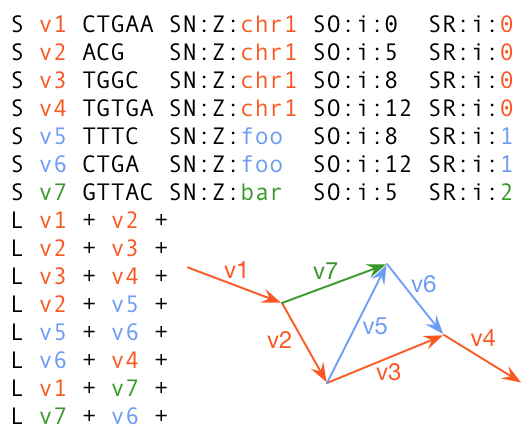

## The Graphical Fragment Assembly (GFA) Format

Initially designed and widely used for sequence assembly graphs, GFA can also
encode arbitrary bidirected sequence graphs. GFA primarily consists of two
types of lines: segment lines (S-lines) and link lines (L-lines). An S-line
represents a sequence; an L-line represents a connection between two oriented
segments. The core of GFA can be loosly described by the following grammar:

```txt
<gfa>    <- <line>+
<line>   <- <S-line> | <L-line>
<S-line> <- 'S' <segId> <seq> <tag>*
<L-line> <- 'L' <segId> <strand> <segId> <strand> <cigar> <tag>*
<strand> <- '+' | '-'
```

where fields on each line are TAB delimited; `<cigar>` and `<tag>` follow the
same format as in [SAM][sam]. For details, please see the [GFA spec][gfa1].

## The Reference GFA (rGFA) Format

In GFA, each base can be indexed by a segment ID and an offset on the segment.
This gives us the *segment coordinate* of the base. The segment coordinate is
unstable -- when we split a segment in half, the coordinate is changed. As a
pan-genome graph demands long-term stability, an ordinary GFA is not a good
fit. rGFA address this issue.

rGFA is a strict subset of GFA. It disallows overlaps between segments and
requires three additional tags on each segment. These tags trace the origin of
the segment:

|Tag |Type|Description|
|:--:|:--:|:----------|
|`SN`|`Z` |Name of stable sequence from which the segment is derived|
|`SO`|`i` |Offset on the stable sequence|
|`SR`|`i` |Rank. `0` if on a linear reference genome; `>0` otherwise|



When segments don't overlap on stable sequences, each base in the graph is
uniquely indexed by the stable sequence name and the offset on the stable
sequence. This is called the *stable coordinate* of the base. The stable
coordinate never changes as long as bases remain in the graph.

The figure on the right shows an example rGFA. In this example, thick arrows
denote segments and thin gray lines denote links. Colors indicate ranks.
We can pinpoint a postion such as `chr1:9` and map existing notations onto the
graph. We can also denote a walk or path in the stable coordinate. For example,
path `v1->v2->v3->v4` corresponds to `chr1:0-17` and path `v1->v2->v5->v6`
corresponds to `chr1:0-8=>foo:8-16`. rGFA inherits the coordinate system of the
current linear reference and smoothly extends it to the graph representation.

## The Graph Alignment Format (GAF)

GAF is a TAB delimited format for sequence-to-graph alignments. It is a strict
superset of the [PAF format][paf]. Each GAF line consists of 12 mandatory
fields:

|Col|Type  |Description|
|--:|:----:|:----------|
|1  |string|Query sequence name|
|2  |int   |Query sequence length|
|3  |int   |Query start (0-based; closed)|
|4  |int   |Query end (0-based; open)|
|5  |char  |Strand relative to the path: "+" or "-"|
|6  |string|Path matching `/([><][^\s><]+(:\d+-\d+)?)+\|([^\s><]+)/`|
|7  |int   |Path length|
|8  |int   |Start position on the path (0-based)|
|9  |int   |End position on the path|
|10 |int   |Number of residue matches|
|11 |int   |Alignment block length|
|12 |int   |Mapping quality (0-255; 255 for missing)|

[sam]: https://en.wikipedia.org/wiki/SAM_(file_format)
[gfa1]: https://github.com/GFA-spec/GFA-spec/blob/master/GFA1.md
[paf]: https://github.com/lh3/miniasm/blob/master/PAF.md
